# Paper Fetching Flow — `get_paper_text()`

```mermaid
flowchart TD
    START([get_paper_text&#40;doi&#41;]) --> CACHE{Cache hit?}
    CACHE -->|Yes| RETURN_CACHED[Return cached text]
    CACHE -->|No| PREPRINT{Is preprint?<br/>10.1101/...}

    %% ── Preprint path ──
    PREPRINT -->|Yes| BIO[bioRxiv Playwright]
    BIO -->|text > 1K| BIO_OK[✓ Got bioRxiv text]
    BIO -->|failed| BIO_FAIL[ ]
    BIO_OK --> CROSSREF_P[CrossRef<br/>&#40;references&#41;]
    BIO_FAIL --> CROSSREF_P

    CROSSREF_P --> PRE_CHECK{Have full text?<br/>&#40;not just CrossRef&#41;}
    PRE_CHECK -->|Yes| COMBINE
    PRE_CHECK -->|No| EPMC_PRE[Europe PMC]
    EPMC_PRE --> COMBINE

    %% ── Non-preprint path ──
    PREPRINT -->|No| EPMC[Europe PMC<br/>&#40;full text XML via PMCID&#41;]
    EPMC -->|text > 100| EPMC_OK[✓ Got Europe PMC text]
    EPMC -->|failed| NCBI[NCBI PMC<br/>&#40;DOI → PMCID → efetch&#41;]

    NCBI -->|text > 100| NCBI_OK[✓ Got NCBI PMC text]
    NCBI -->|failed| NCBI_FAIL[ ]

    EPMC_OK --> CROSSREF_NP[CrossRef<br/>&#40;always, for references&#41;]
    NCBI_OK --> CROSSREF_NP
    NCBI_FAIL --> CROSSREF_NP

    CROSSREF_NP --> SHORT{PMC text < 15K chars<br/>AND have PMCID?}
    SHORT -->|Yes| PW_SHORT[PMC Playwright<br/>&#40;replace short text&#41;]
    SHORT -->|No| FULLTEXT_CHECK

    PW_SHORT -->|better text| PW_REPLACE[✓ Replaced with<br/>Playwright text]
    PW_SHORT -->|no improvement| FULLTEXT_CHECK

    PW_REPLACE --> FULLTEXT_CHECK
    FULLTEXT_CHECK{Have full text?<br/>&#40;not just CrossRef&#41;}

    FULLTEXT_CHECK -->|Yes| COMBINE
    FULLTEXT_CHECK -->|No| UNPAYWALL[Unpaywall<br/>&#40;OA PDF lookup, skip PMC PDFs&#41;]

    UNPAYWALL -->|text > 1K| UNPAYWALL_OK[✓ Got Unpaywall text]
    UNPAYWALL -->|failed| PUB[Publisher HTML<br/>&#40;scrape doi.org redirect&#41;]

    UNPAYWALL_OK --> COMBINE
    PUB -->|text > 1K| PUB_OK[✓ Got publisher text]
    PUB -->|failed / blocked| PUB_FAIL{Have PMCID?}

    PUB_OK --> COMBINE
    PUB_FAIL -->|Yes| PW_FALLBACK[PMC Playwright<br/>&#40;last resort fallback&#41;]
    PUB_FAIL -->|No| COMBINE

    PW_FALLBACK -->|text > 1K| PW_FB_OK[✓ Got PMC Playwright text]
    PW_FALLBACK -->|failed| COMBINE

    PW_FB_OK --> COMBINE

    %% ── Final assembly ──
    COMBINE[Combine text parts<br/>source1 + source2 + ...]
    COMBINE --> CACHE_CHECK{Only CrossRef?}
    CACHE_CHECK -->|Yes| SKIP_CACHE[Skip cache<br/>&#40;not useful alone&#41;]
    CACHE_CHECK -->|No| SAVE_CACHE[Save to cache]
    SKIP_CACHE --> RETURN
    SAVE_CACHE --> RETURN
    RETURN([Return &#40;text, sources, from_cache&#41;])

    %% ── Styling ──
    classDef source fill:#e1f5fe,stroke:#0288d1
    classDef success fill:#e8f5e9,stroke:#388e3c
    classDef decision fill:#fff3e0,stroke:#f57c00
    classDef endpoint fill:#f3e5f5,stroke:#7b1fa2

    class BIO,EPMC,NCBI,CROSSREF_P,CROSSREF_NP,PW_SHORT,UNPAYWALL,PUB,PW_FALLBACK,EPMC_PRE source
    class BIO_OK,EPMC_OK,NCBI_OK,UNPAYWALL_OK,PUB_OK,PW_REPLACE,PW_FB_OK success
    class CACHE,PREPRINT,PRE_CHECK,SHORT,FULLTEXT_CHECK,CACHE_CHECK,PUB_FAIL decision
    class START,RETURN,RETURN_CACHED endpoint
```

## Source Priority

### Preprint Path (10.1101/...)
| Priority | Source | Method |
|----------|--------|--------|
| 1 | bioRxiv Playwright | Headless browser renders bioRxiv page |
| 2 | CrossRef | Always fetched for reference list |
| 3 | Europe PMC | Fallback if Playwright fails |

### Non-Preprint Path
| Priority | Source | Method |
|----------|--------|--------|
| 1 | Europe PMC | Full text XML via PMCID lookup |
| 2 | NCBI PMC | DOI → PMCID converter → efetch XML |
| 3 | CrossRef | Always fetched for reference list |
| 4 | PMC Playwright | Supplements short PMC text (< 15K chars) |
| 5 | Unpaywall | OA PDF download + PyMuPDF extraction |
| 6 | Publisher HTML | Direct scraping via doi.org redirect |
| 7 | PMC Playwright | Last resort if publisher is blocked |

## Key Details

- **Cache**: File-based JSON cache keyed by DOI. CrossRef-only results are NOT cached.
- **Unpaywall**: Queries `api.unpaywall.org`, skips PMC PDF URLs (they return HTML redirects).
- **PMC Playwright** appears twice in non-preprint path: once to supplement short API text, once as final fallback for blocked publishers.
- **Text parts are combined**: A paper can have text from multiple sources (e.g., `europe_pmc+crossref`).
