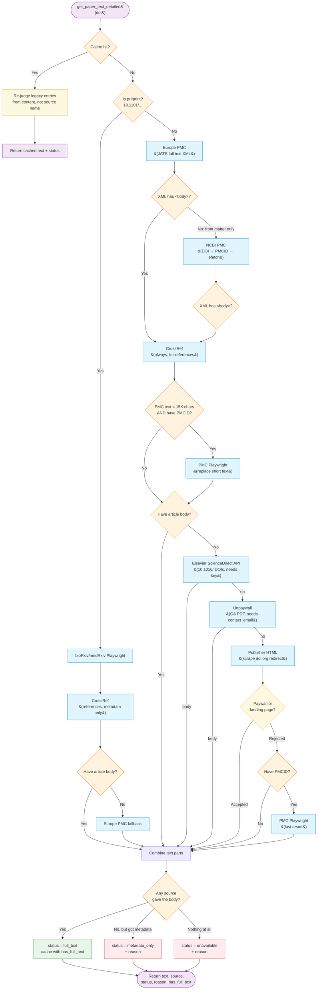

# Paper Fetching Flow — `get_paper_text_detailed()`

The fetching logic lives in the `paper-text-fetcher` package
(https://github.com/catalystneuro/paper-text-fetcher). `fetch_paper.py` in this
repository is a thin wrapper that supplies our cache location and the contact
details we identify ourselves with. The rendered version of this diagram, with
counts from the current corpus, is produced by `render_flow.py` and written to
`output/paper_fetching_flow.png`.

The central distinction in this flow is between text that contains the article
body and text that does not. A title, an abstract, and a reference list can be
retrieved for nearly every DOI, so a fetcher that reports success whenever it
received a non-empty string will silently supply metadata where a paper was
expected. Every source is therefore validated before its output is accepted, and
the result carries an explicit status.

```mermaid
flowchart TD
    START([get_paper_text_detailed&#40;doi&#41;]) --> CACHE{Cache hit?}
    CACHE -->|Yes| REJUDGE[Re-judge legacy entries<br/>from content, not source name]
    REJUDGE --> RETURN_CACHED[Return cached text + status]
    CACHE -->|No| PREPRINT{Is preprint?<br/>10.1101/...}

    %% ── Preprint path ──
    PREPRINT -->|Yes| BIO[bioRxiv/medRxiv Playwright]
    BIO --> CROSSREF_P
    CROSSREF_P[CrossRef<br/>&#40;references, metadata only&#41;] --> PRE_CHECK{Have article body?}
    PRE_CHECK -->|Yes| COMBINE
    PRE_CHECK -->|No| EPMC_PRE[Europe PMC fallback]
    EPMC_PRE --> COMBINE

    %% ── Non-preprint path ──
    PREPRINT -->|No| EPMC[Europe PMC<br/>&#40;JATS full text XML&#41;]
    EPMC --> XML_BODY{XML has &lt;body&gt;?}
    XML_BODY -->|No: front matter only| NCBI[NCBI PMC<br/>&#40;DOI → PMCID → efetch&#41;]
    XML_BODY -->|Yes| CROSSREF_NP
    NCBI --> NCBI_BODY{XML has &lt;body&gt;?}
    NCBI_BODY --> CROSSREF_NP

    CROSSREF_NP[CrossRef<br/>&#40;always, for references&#41;] --> SHORT{PMC text < 15K chars<br/>AND have PMCID?}
    SHORT -->|Yes| PW_SHORT[PMC Playwright<br/>&#40;replace short text&#41;]
    SHORT -->|No| FULLTEXT_CHECK
    PW_SHORT --> FULLTEXT_CHECK

    FULLTEXT_CHECK{Have article body?}
    FULLTEXT_CHECK -->|Yes| COMBINE
    FULLTEXT_CHECK -->|No| ELSEVIER[Elsevier ScienceDirect API<br/>&#40;10.1016/ DOIs, needs key&#41;]

    ELSEVIER -->|body| COMBINE
    ELSEVIER -->|no| UNPAYWALL[Unpaywall<br/>&#40;OA PDF, needs contact_email&#41;]
    UNPAYWALL -->|body| COMBINE
    UNPAYWALL -->|no| PUB[Publisher HTML<br/>&#40;scrape doi.org redirect&#41;]

    PUB --> PAYWALL_GATE{Paywall or<br/>landing page?}
    PAYWALL_GATE -->|Rejected| PMCID_CHECK
    PAYWALL_GATE -->|Accepted| COMBINE
    PMCID_CHECK{Have PMCID?} -->|Yes| PW_FALLBACK[PMC Playwright<br/>&#40;last resort&#41;]
    PMCID_CHECK -->|No| COMBINE
    PW_FALLBACK --> COMBINE

    %% ── Final assembly ──
    COMBINE[Combine text parts] --> IS_FULL{Any source<br/>gave the body?}
    IS_FULL -->|Yes| FULL[status = full_text<br/>cache with has_full_text]
    IS_FULL -->|No, but got metadata| META[status = metadata_only<br/>+ reason]
    IS_FULL -->|Nothing at all| NONE[status = unavailable<br/>+ reason]
    FULL --> RETURN
    META --> RETURN
    NONE --> RETURN
    RETURN([Return text, source,<br/>status, reason, has_full_text])

    classDef source fill:#e1f5fe,stroke:#0288d1
    classDef success fill:#e8f5e9,stroke:#388e3c
    classDef decision fill:#fff3e0,stroke:#f57c00
    classDef gate fill:#fff8e1,stroke:#f9a825
    classDef endpoint fill:#f3e5f5,stroke:#7b1fa2
    classDef fail fill:#ffebee,stroke:#d32f2f

    class BIO,EPMC,NCBI,CROSSREF_P,CROSSREF_NP,PW_SHORT,UNPAYWALL,PUB,PW_FALLBACK,EPMC_PRE,ELSEVIER source
    class FULL success
    class CACHE,PREPRINT,PRE_CHECK,SHORT,FULLTEXT_CHECK,IS_FULL,PMCID_CHECK,XML_BODY,NCBI_BODY decision
    class PAYWALL_GATE,REJUDGE gate
    class META,NONE fail
    class START,RETURN,RETURN_CACHED endpoint
```

## The Three Statuses

| Status | Meaning | Usable for |
|--------|---------|------------|
| `full_text` | A source delivered the article body | Reuse classification, direct reference scanning |
| `metadata_only` | The DOI resolves and we have a title, abstract, and usually a reference list, but no source would give us the body | Mining the bibliography for dataset DOIs. Not reuse classification |
| `unavailable` | No source returned anything | Nothing |

The direct and indirect pathways treat `metadata_only` differently on purpose.
The indirect pathway drops those papers, because it infers reuse from how a paper
discusses the work it cites and that discussion lives in Methods, Results, and
Data Availability. The direct pathway still scans them, because a dataset DOI
sitting in a CrossRef bibliography is a genuine direct citation and is detectable
without the body. Those results carry `has_full_text: False` so they remain
separable in analysis.

## How the Body Is Detected

Two conditions must both hold. A source capable of delivering a body must claim
to have done so, and the text must read like a body: at least
`MIN_FULL_TEXT_CHARS` (6000) characters, no paywall or bot-check phrases near the
top, and at least one section heading that essentially every research article has
and no abstract does.

For JATS records from Europe PMC and NCBI there is a more direct signal. Both
return a record containing only `<front>` when an article is indexed but not
open, so the presence of a substantive `<body>` element is checked instead of
relying on the text heuristics.

## Source Priority

### Preprint Path (10.1101/...)
| Priority | Source | Method |
|----------|--------|--------|
| 1 | bioRxiv Playwright | Headless browser renders the bioRxiv page |
| 2 | CrossRef | Always fetched for the reference list, never counts as full text |
| 3 | Europe PMC | Fallback when Playwright fails |

### Non-Preprint Path
| Priority | Source | Method |
|----------|--------|--------|
| 1 | Europe PMC | JATS full text XML via PMCID |
| 2 | NCBI PMC | DOI to PMCID conversion, then efetch |
| 3 | CrossRef | Always fetched for references, never counts as full text |
| 4 | PMC Playwright | Supplements short PMC text (< 15K chars) |
| 5 | Elsevier ScienceDirect | Needs an API key and entitlement, 10.1016/ DOIs only |
| 6 | Unpaywall | Open-access PDF, extracted with PyMuPDF |
| 7 | Publisher HTML | Scraped from the doi.org redirect, most likely to hit a paywall |
| 8 | PMC Playwright | Last resort when the publisher blocks us |

## Caching

Text is cached as one JSON file per DOI, and each entry records whether it holds
an article body. Entries written before that flag existed are re-judged from
their content on read rather than trusted by their source name, because the older
code stored landing pages under the `publisher_html` source. Re-judging on read
corrects the existing cache without a refetch.

CrossRef-only results are still not written to the cache, since they are cheap to
re-fetch and carry no body.
